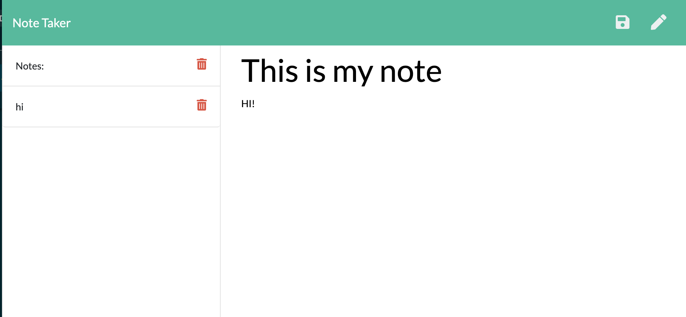

# Note

    
## Table of Contents
==================
* [Description](#Description) 
* [Installation](#Installation)
* [Usage](#Usage) 
* [Contributing](#contributing) 
* [license](#license) 
* [Questions](#Questions)

==================
    
## Description
    
Note is an online note taker to create, store and delete your thoughts. 
The application was made using javascript, node and express.
    
## Installation
    
To replicate, make sure to run NPM init, then the dependencies express and nodemon to create the server. then run npm run watch to initiate server.
    
## Usage

Can use this application on the web. Will store previously made notes into a server. Website running on heroku. to run on own server refer to installation instructions.
    
## Contributing

feel free to contribute by forking the repo.
### license

This application is covered under the MIT License. Please see any additional files in GitHub for details. 

## Sample

[Link to deployed website]()
### Questions

If you have any questions please contact at [beccaablanton@gmail.com](beccaablanton@gmail.com)

[Link to GitHub Profile](https://www.github.com/BeccaBlanton)

